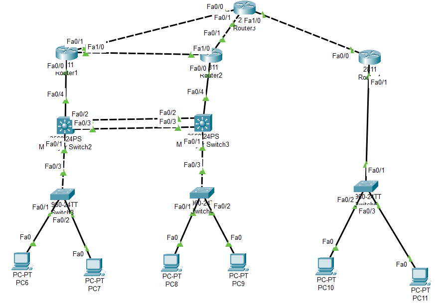

# Проект сети предприятия в Cisco Packet Tracer

Проект повторяет заданную топологию: слева расположен центральный офис, сверху `Router2` имитирует сеть интернет/провайдера, справа расположен филиал. Между центральным офисом и филиалом построены GRE-туннели, защищенные IPsec. Внешняя маршрутизация между роутерами выполнена на BGP, внутри центрального офиса используется OSPF.

## Состав проекта

- `docs/` - описание проекта, топология, адресация, маршрутизация и проверка.
- `configs/` - конфигурации сетевых устройств.
- `pics/` - схема и скриншоты из Cisco Packet Tracer.
- `packet-tracer/` - итоговый файл проекта `.pkt`.
- `project.drawio` - редактируемая схема для draw.io/diagrams.net.

## Краткая схема

## Используемые технологии

- VLAN в центральном офисе и филиале.
- OSPF внутри центрального офиса.
- BGP между маршрутизаторами.
- NAT overload на `Router0` и `Router1` для выхода центрального офиса в интернет.
- GRE-туннели между центральным офисом и филиалом.
- IPsec для защиты GRE-трафика.
- HSRP на multilayer-коммутаторах для резервирования шлюза по умолчанию.
- L2 EtherChannel trunk между `MultilayerSwitch0` и `MultilayerSwitch1`.
- DHCP для автоматической выдачи адресов ПК.
- ACL для ограничения гостевой VLAN филиала.

## Роли устройств

| Устройство | Роль |
|---|---|
| `Router0` | edge-роутер центрального офиса, NAT, GRE/IPsec tunnel 10 |
| `Router1` | edge-роутер центрального офиса, NAT, GRE/IPsec tunnel 20 |
| `Router2` | имитация интернет-провайдера |
| `Router3` | edge-роутер филиала |
| `MultilayerSwitch0`, `MultilayerSwitch1` | L3-коммутаторы центрального офиса |
| `Switch0`, `Switch1` | access-коммутаторы центрального офиса |
| `Switch2` | access-коммутатор филиала |

## Ожидаемый результат

- ПК центрального офиса получают адреса из VLAN 10/20/30/40.
- ПК филиала получают адреса из VLAN 50/60.
- Центральный офис выходит в интернет через NAT на `Router0`/`Router1`.
- Для VLAN центрального офиса шлюзом по умолчанию является HSRP-адрес `.1`.
- `Router0` и `Router1` строят GRE over IPsec туннели до `Router3`.
- BGP используется максимально просто: только underlay-маршрутизация между физическими роутерами.
- Корпоративные маршруты центрального офиса и филиала распространяются через OSPF по GRE-туннелям.
- Трафик между центральным офисом и филиалом идет через туннели, а не напрямую через сеть провайдера.
